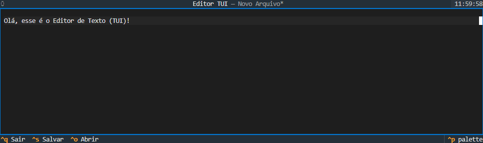

# Editor-de-Texto-em-Python
Este projeto é um Editor de Texto que funciona diretamente no seu terminal. Ele utiliza a biblioteca Textual, do Python, para criar uma interface interativa, permitindo a edição de arquivos. Ele possui opções de salvar arquivos, abrir arquivos e sair do programa.

<p align = "left">

</p>

## Demonstração



Interface do editor de texto em execução no terminal.

## Instalação e Pré-requisitos

### Pré-requisitos

- Python 3.8 ou superior instalado no sistema;
- Terminal ou prompt de comando para executar o programa;
- Sistema operacional Windows, Linux ou macOS.

### Passos para Instalar

1. Baixe ou clone o projeto;
2. Verifique se você possui Python 3 instalado no computador.

### Como Instalar as Dependências

1. Abra o Terminal, dentro da pasta do projeto;
   
2. Execute o seguinte comando para instalar a biblioteca textual:
   ```
   pip install textual
   ```
   
## Usos e Exemplos

Após baixar ou clonar o projeto, siga os passos abaixo para executar o jogo no terminal.

### Executando o Editor de Texto:

No Windows:

```
python editor.py
```

No Linux/macOS:

```
python3 editor.py
```

## Como Utilizar

1. Após executar o editor de texto, digite o texto. 

2. Ao pressionar as teclas CTRL + S, do seu teclado, caso o arquivo estiver aberto o conteúdo do arquivo é salvo, porém, caso o seja um novo arquivo, a ação se comportará como "Salvar Como" (CTRL + A). 

3. Ao pressionar as teclas CTRL + A, do seu teclado, o editor de texto solicitará um novo nome ou o caminho do arquivo e, em seguida, salvar o conteúdo.

4. Ao pressionar as teclas CTRL + O, do seu teclado, o editor de texto solicitará ao usuário o caminho de um arquivo para exibir seu conteúdo para a edição.

5. Ao pressionar as teclas CTRL + Q, do seu teclado, caso não houver alterações no arquivo o programa fechará normalmente. Entretanto, caso tiver alterações o programa exibirá uma tela de confirmação, perguntando ao usuário se ele realmente deseja sair ou não.

## Estrutura do Projeto

```
Ratreador-de-Gastos-em-Python/
├── images/
│   └── terminal-editor-de-texto.png
├── LICENSE
├── README.md
└── editor.py 
```

## Licença 

Este projeto está licenciado sob a MIT License - veja o arquivo [LICENSE](LICENSE) para mais detalhes. 
